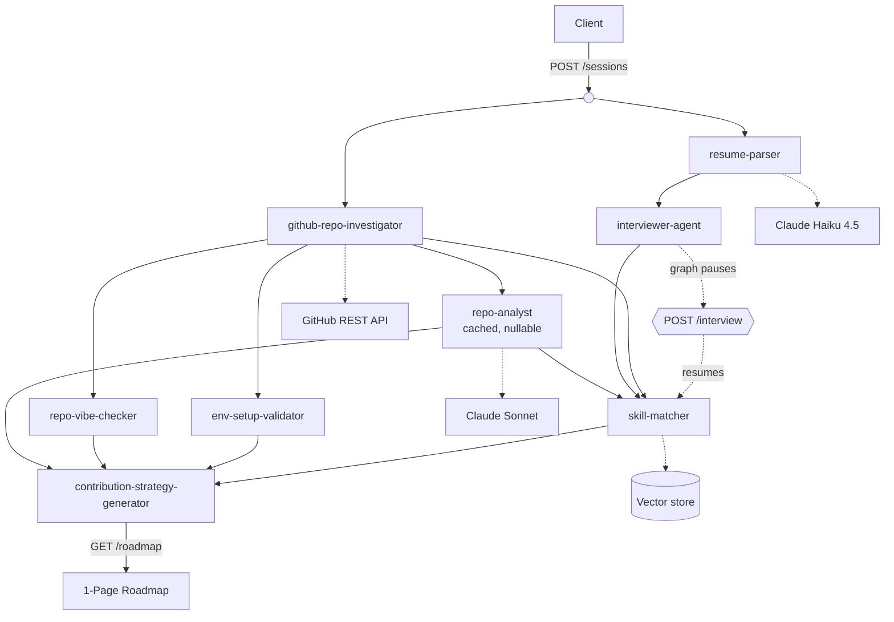
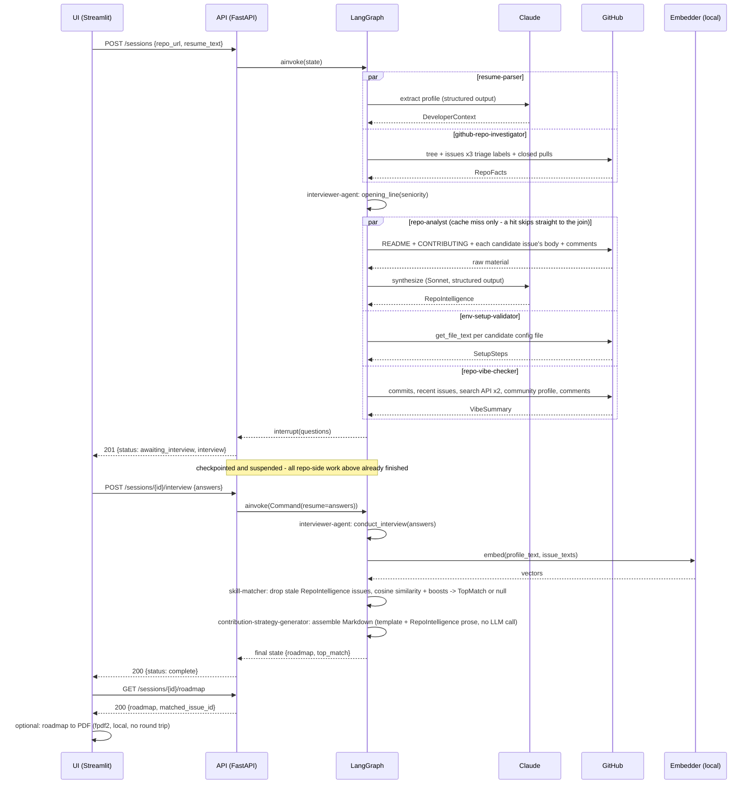
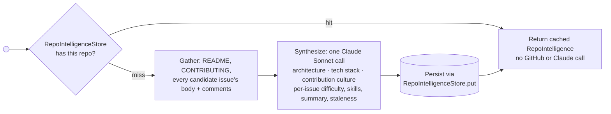

<div align="center">

# 🚀 Pocket OSS Agent

**Your AI-powered co-pilot for open-source contribution.**  
Drop your resume. Pick a repo. Get a personalized, one-page contribution roadmap in seconds.

[](https://github.com/rvishravars/pocket-oss-agent/actions/workflows/ci.yml)
[](LICENSE)
[](https://python.org)
[](https://github.com/langchain-ai/langgraph)
[](https://github.com/pgvector/pgvector)
[](https://docs.github.com/rest)

</div>

---

## ✨ What is this?

Getting started with open source is hard. You don't know which issue to pick, whether maintainers are active, or if your skills even match the codebase.

**Pocket OSS Agent** solves this with a multi-agent AI pipeline that:
1. Reads your resume to understand your skills
2. Interviews you to understand your *goals*
3. Investigates the target GitHub repo through the GitHub API
4. Finds the single best issue for you - semantically, not just by label
5. Delivers a **one-page contribution roadmap** tailored to you

---

## 🎯 User Flow

```
Login → Upload Resume → Interview → Pick Repo → Agentic Analysis → 1-Page Roadmap
```

| Step | What happens |
|------|-------------|
| 1. **Authentication** | Google OAuth 2.0 *(planned, not built)* |
| 2. **Profile Ingestion** | AI parses your PDF resume into a structured Developer Context |
| 3. **Interactive Discovery** | Interviewer Agent clarifies your goals, time budget, and preferences |
| 4. **Project Selection** | You provide any public GitHub repository URL |
| 5. **Agentic Analysis** | Resume Agent + Repo Agent work in parallel |
| 6. **Strategy Generation** | Weaver Agent synthesizes everything into a single-screen roadmap |

---

## 🤖 Agent Architecture

Seven specialized agents, orchestrated as a [LangGraph](https://github.com/langchain-ai/langgraph) DAG behind a FastAPI service:



The interview is the only step needing a human mid-run, so the graph interrupts
there and a checkpointer holds the state across the request that answers it.
The whole repository branch keeps running while it waits.

| Agent | Role | Status |
|-------|------|--------|
| **Resume Parser** | Extracts name, languages, frameworks, seniority and domain from a PDF | ✅ Built |
| **Interviewer** | Asks 4 to 5 targeted questions to capture contribution intent | ✅ Built |
| **Repo Investigator** | Builds a repo fact sheet: layout, candidate issues, PR velocity | ✅ Built |
| **Repo Analyst** | Offline, cached synthesis: architecture, contribution culture, per-issue difficulty and staleness | ✅ Built and wired in |
| **Env Setup Validator** | Detects the toolchain and drafts the First Mile guide | ✅ Built |
| **Vibe Checker** | Scores maintainer responsiveness and welcome signals | ✅ Built |
| **Skill Matcher** | Ranks candidate issues against the developer profile | ✅ Built |
| **Strategy Generator** | Weaves all signals into the final one-page roadmap | ✅ Built |

All eight are implemented with 100% test and branch coverage and wired into
the graph. Repo Analyst is a real node like any other, but its output is a
**nullable enrichment** everywhere it's consumed - a cache miss that fails
degrades the roadmap to exactly what it would have said before this agent
existed, rather than failing the request. See
[Offline Repo Intelligence](#offline-repo-intelligence) below for what it
runs once per repository, and what `skill-matcher` and
`contribution-strategy-generator` each do with it.

One known gap, recorded in the specs rather than papered over:

- **Setup steps are never marked verified**, because executing an untrusted
  repository's own install commands needs a sandbox that does not exist yet.

Issue matching's similarity floor was recalibrated 2026-08-16 against nine
real repos - see `specs/agents/skill-matcher.md` for the evidence.

### Low-level sequence

The DAG above shows *what depends on what*; this shows *what actually crosses
a process boundary*, in order - the two HTTP round trips around the
interview, exactly which GitHub endpoints each agent calls, and where an LLM
is and isn't involved (only resume extraction is; the roadmap's prose is
templated from the assembled facts, not model output):



### Offline Repo Intelligence

The live sequence above reasons from `repo_facts` alone: titles, labels,
counts - deliberately token-budgeted, no issue bodies, no comment threads, no
README text. That is enough for label filtering and merge-rate arithmetic,
but not enough for a recommendation that reads like it came from someone who
actually looked at the repository.

`repo-analyst` is where that raw material gets read - and because reading it
is expensive (a wide GitHub fetch plus a Sonnet call reasoning across all of
it at once), it runs **offline, once per repository**, not once per user
session. A popular repository is analyzed once and reused by every
contributor who asks about it afterward, not recomputed per request:



Measured against a real repository (`langchain-ai/langchain`), this is a
different tier of output than label-based filtering can produce - not just
"here are 10 open issues," but *"6 of these 10 already look claimed, because
this repo gets a stampede of contributors independently opening competing
PRs on the same issue."* That read came from the comment threads, not from
any count or label.

**Status:** implemented, wired into the live pipeline, and verified against
real repositories. `skill-matcher` drops any candidate this read as already
claimed before ranking and swaps in its per-issue summary as the rationale
when one covers the winning issue; `contribution-strategy-generator` shows
the architecture summary and contribution-culture read directly in the
roadmap. Both treat it as optional - a cache miss that fails renders exactly
what the roadmap said before this agent existed, never blocks the request.
`RepoIntelligenceStore` is in-memory or file-backed today (a Docker volume
persists it across container rebuilds); Postgres is planned but deliberately
deferred, since the store is a protocol and neither consumer needs to change
when that lands. See
[`specs/agents/repo-analyst.md`](specs/agents/repo-analyst.md).

---

## 🌟 Core Features

### 🧠 Intelligent Skill Matching
Semantic similarity between your resume profile plus interview answers and the
repository's open issues, not just keyword matching. The store sits behind a
protocol: in-memory by default, `pgvector` for production. The similarity
floor is calibrated against real repos, recorded in
`specs/agents/skill-matcher.md`. When `repo-analyst` has read a candidate
issue's own comment thread, an already-claimed issue never reaches the
ranking, and the "why you" rationale is its technical read instead of a
generic template sentence.

### 🔍 Token-Efficient GitHub Access
Agents summarize repository data (issue lists, file trees, PR history) before any of it reaches an LLM. Nodes that fetch a fixed sequence deterministically use the GitHub REST API directly; the MCP Server is reserved for paths where an LLM chooses its own tools.

### 💬 Vibe Check
Real-time sentiment analysis on maintainer responsiveness: commit recency, issue response time, PR merge rate, and contributor-welcome signals.

### 🚀 First Mile Setup
Auto-detects your repo's toolchain (Docker, Poetry, npm, Gradle, etc.) and generates a validated step-by-step local environment setup.

---

## 📄 The One-Page Roadmap

Every roadmap fits in a single screen and contains four sections.
Setup steps are marked ⚠️ until the sandboxed dry run lands, because a step is
never reported verified without having been executed:

```markdown
# OSS Contribution Roadmap: {repo}
> 🎯 Goal: portfolio · ⏱️ Availability: light (~5 hrs/week)

## 🗺️ Architecture Snapshot
- `src/` - Core library logic
- `tests/` - Unit and integration tests

## 🚀 First Mile Setup
1. `git clone ...` ⚠️ _~1 min_
2. `uv sync` ⚠️ _~2 min_
3. `docker compose up -d` ⚠️ _~3 min_
> ⚠️ Steps are inferred from config files, not yet executed.

## 🎯 Your First Contribution
**Issue:** Add support for async Python client
**Why you:** 5 years Python + asyncio. Matches your portfolio goal.

## 💬 Vibe Check
🟢 Highly welcoming - last commit 2 days ago, issues answered in ~1 day.
```

---

## 🛠️ Technical Stack

| Layer | Technology |
|-------|-----------|
| **AI Model** | Claude Haiku 4.5 for resume extraction (single-shot structured output); Claude Sonnet for `repo-analyst`'s offline synthesis (judgment across a whole repository, not single-field extraction) |
| **Orchestration** | Python · FastAPI · LangGraph |
| **Embeddings** | sentence-transformers, behind a protocol - the production embedder, packaged as an *(optional install extra)* since it pulls in torch; the API now requires it rather than silently falling back to the non-semantic test stand-in |
| **Database** | PostgreSQL + `pgvector` *(implemented, not yet exercised against a live database)* |
| **GitHub Tooling** | GitHub REST API; MCP Server where an LLM picks tools |
| **UI** | Streamlit demo, thin client over the API *(built)*; Next.js production UI *(planned)* |
| **Deployment** | Docker Compose - one image, `api` + `ui` services, credentials from `.env` |

---

## 🤖 Agent Skills

The eight agents are specified under `specs/agents/`.
These are product specifications that the implementation is written against, not
tooling for a coding assistant:

| Skill | Purpose |
|-------|---------|
| [`interviewer-agent`](specs/agents/interviewer-agent.md) | Dynamic pre-analysis discovery interview |
| [`resume-parser`](specs/agents/resume-parser.md) | Structured developer profile extraction from PDF |
| [`github-repo-investigator`](specs/agents/github-repo-investigator.md) | Deep repo analysis via the GitHub API |
| [`repo-analyst`](specs/agents/repo-analyst.md) | Offline, cached repo synthesis - architecture, culture, per-issue enrichment |
| [`skill-matcher`](specs/agents/skill-matcher.md) | Semantic issue matching with interview filters |
| [`env-setup-validator`](specs/agents/env-setup-validator.md) | Auto-detect toolchain + generate First Mile setup |
| [`repo-vibe-checker`](specs/agents/repo-vibe-checker.md) | Contributor-friendliness sentiment analysis |
| [`contribution-strategy-generator`](specs/agents/contribution-strategy-generator.md) | Weaves all outputs into the final 1-page roadmap |

---

## 🗺️ Roadmap

- [x] `github-repo-investigator` - repo fact sheet from a URL
- [x] `repo-vibe-checker` - maintainer responsiveness and welcome signals
- [x] `env-setup-validator` - toolchain detection and First Mile guide
- [x] `interviewer-agent` - headless discovery interview
- [x] `contribution-strategy-generator` - the one-page roadmap
- [x] `resume-parser` - PDF extraction + Claude structured output
- [x] `skill-matcher` - semantic issue matching
- [x] LangGraph orchestration + FastAPI
- [x] Streamlit MVP demo
- [x] Calibrate the similarity threshold, so matching actually returns a pick
- [x] `repo-analyst` - offline, cached repo intelligence (architecture, culture, per-issue enrichment)
- [x] Wire `repo-analyst` into `skill-matcher` and `contribution-strategy-generator`
- [ ] Sandboxed dry run, so setup steps can be marked verified
- [ ] Postgres checkpointer and pgvector against a live database
- [ ] Next.js production UI
- [ ] Auth (Google OAuth 2.0)

---

## 🧪 Development

```bash
python -m venv .venv && source .venv/bin/activate
pip install -e ".[dev]"

pytest -q                 # fully offline: no API key, no model download, no database
pytest -m live            # opt in to the paid-API checks (deselected by default)
ruff check . && ruff format --check .
```

## 🚀 Redeploying / running for real

Docker Compose is the supported way to run the whole thing: one image, two
services (`api`, `ui`), credentials from an env file, no host Python
environment to keep in sync.

**1. Provide credentials:**

```bash
cp .env.example .env
```

Edit `.env`:

```bash
ANTHROPIC_API_KEY=...          # required - resume extraction calls Claude
GITHUB_TOKEN=...               # strongly recommended - `gh auth token` works; unauthenticated
                                # GitHub calls cap at 60/hour, which the repo investigator exceeds
```

`.env` is gitignored; `.env.example` is the checked-in template.

**2. Build and start both services:**

```bash
docker compose up --build
```

- API: `http://localhost:8000` (health-checked; `ui` waits for it before starting)
- UI: `http://localhost:8501`

The two containers talk to each other over the compose network
(`POCKET_OSS_API_URL=http://api:8000` inside `ui`), so there is no
localhost-port-collision risk from something else on the host - the failure
mode that motivated containerizing this in the first place. If port 8000 or
8501 is already taken by something else, remap it in `docker-compose.yml`'s
`ports:` list rather than fighting for the host port.

The image installs every extra the live app needs - `serve`, `embeddings`
(pulls in `sentence-transformers` + `torch`; this is what makes issue
matching semantic rather than a no-op), `ui`, `pdf` - so there is nothing
else to install. `Dockerfile` copies `scripts/` last, after the dependency
install, so editing the Streamlit UI doesn't trigger a re-download of torch
on rebuild.

Paste a resume or upload a PDF, answer the interview, get the rendered
roadmap with a PDF export button. Resume text under 200 characters is
rejected as unreadable (the threshold `resume-parser` uses to tell real text
from a near-empty scanned PDF) - paste a full resume, not a snippet.

**Without Docker:** `pip install -e ".[serve,embeddings,ui,pdf]"`, set the
same two environment variables, then `uvicorn
pocket_oss_agent.api:create_app --factory --reload` in one terminal and
`streamlit run scripts/streamlit_app.py` in another. If the API and UI end up
in different Python environments, install the extras in both - each process
only sees its own interpreter. The UI lives in `scripts/`, not the package,
so it is verified by running it rather than by the pytest suite - the same
convention as `run_pipeline.py`.

### The API

The interview needs a human mid-run, so a session is a resource that spans two
requests:

| Endpoint | Does |
|----------|------|
| `POST /sessions` | Start a run. Returns a session id and the interview questions |
| `GET /sessions/{id}` | Status, plus the questions while paused |
| `POST /sessions/{id}/interview` | Submit answers; resumes the graph |
| `GET /sessions/{id}/roadmap` | The finished Markdown |

Repository analysis, the vibe check and setup detection all run while the
interview waits, so answering is the only thing on the critical path.

Inputs the caller got wrong return `422` (unreadable resume, malformed repo
URL); asking for a roadmap before answering returns `409`.

Supported on Python 3.11 through 3.14.

The default suite reaches nothing external.
The LLM, the embedder and the vector store are injected behind protocols, so
tests run against fakes with no API key, no model download and no database.
CI never spends money and cannot.

Two things are opt-in:

- `GITHUB_TOKEN` to run the agents against a real repository via
  `scripts/run_pipeline.py`.
- `pytest -m live` for the handful of checks that call the paid Claude API.
  These are deselected by default everywhere, and skipped outright without a
  credential.

---

## 🤝 Contributing

Contributions are welcome! Please open an issue first to discuss what you'd like to change.

---

## 📄 License

MIT © [rvishravars](https://github.com/rvishravars)
