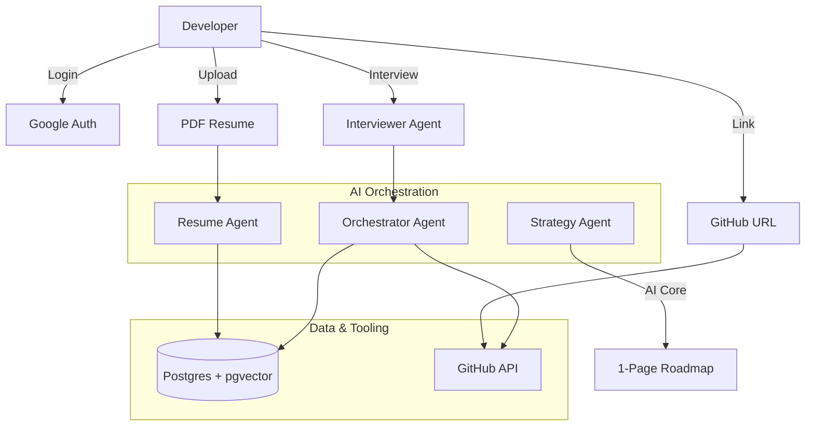

<div align="center">

# 🚀 Pocket OSS Agent

**Your AI-powered co-pilot for open-source contribution.**  
Drop your resume. Pick a repo. Get a personalized, one-page contribution roadmap in seconds.

[](https://github.com/rvishravars/pocket-oss-agent/actions/workflows/ci.yml)
[](LICENSE)
[](https://python.org)
[](https://github.com/langchain-ai/langgraph)
[](https://github.com/pgvector/pgvector)
[](https://docs.github.com/rest)

</div>

---

## ✨ What is this?

Getting started with open source is hard. You don't know which issue to pick, whether maintainers are active, or if your skills even match the codebase.

**Pocket OSS Agent** solves this with a multi-agent AI pipeline that:
1. Reads your resume to understand your skills
2. Interviews you to understand your *goals*
3. Investigates the target GitHub repo through the GitHub API
4. Finds the single best issue for you - semantically, not just by label
5. Delivers a **one-page contribution roadmap** tailored to you

---

## 🎯 User Flow

```
Login → Upload Resume → Interview → Pick Repo → Agentic Analysis → 1-Page Roadmap
```

| Step | What happens |
|------|-------------|
| 1. **Authentication** | Secure login via Google OAuth 2.0 |
| 2. **Profile Ingestion** | AI parses your PDF resume into a structured Developer Context |
| 3. **Interactive Discovery** | Interviewer Agent clarifies your goals, time budget, and preferences |
| 4. **Project Selection** | You provide any public GitHub repository URL |
| 5. **Agentic Analysis** | Resume Agent + Repo Agent work in parallel |
| 6. **Strategy Generation** | Weaver Agent synthesizes everything into a single-screen roadmap |

---

## 🤖 Agent Architecture

The system uses **seven specialized agents**, to be orchestrated via [LangGraph](https://github.com/langchain-ai/langgraph):



| Agent | Role | Status |
|-------|------|--------|
| **Resume Parser** | Extracts name, languages, frameworks, seniority and domain from a PDF | Spec only |
| **Interviewer** | Asks 4 to 5 targeted questions to capture contribution intent | ✅ Built |
| **Repo Investigator** | Builds a repo fact sheet: layout, candidate issues, PR velocity | ✅ Built |
| **Env Setup Validator** | Detects the toolchain and drafts the First Mile guide | ✅ Built |
| **Vibe Checker** | Scores maintainer responsiveness and welcome signals | ✅ Built |
| **Skill Matcher** | Ranks candidate issues against the developer profile | Spec only |
| **Strategy Generator** | Weaves all signals into the final one-page roadmap | ✅ Built |

Five of the seven are implemented with 100% test coverage.
The two outstanding ones need Postgres, pgvector and an LLM.
State is threaded between them by hand today; LangGraph orchestration is not
wired up yet.

---

## 🌟 Core Features

### 🧠 Intelligent Skill Matching
Uses **pgvector** to run semantic similarity searches between your resume profile + interview answers and open GitHub issues - not just keyword matching.

### 🔍 Token-Efficient GitHub Access
Agents summarize repository data (issue lists, file trees, PR history) before any of it reaches an LLM. Nodes that fetch a fixed sequence deterministically use the GitHub REST API directly; the MCP Server is reserved for paths where an LLM chooses its own tools.

### 💬 Vibe Check
Real-time sentiment analysis on maintainer responsiveness: commit recency, issue response time, PR merge rate, and contributor-welcome signals.

### 🚀 First Mile Setup
Auto-detects your repo's toolchain (Docker, Poetry, npm, Gradle, etc.) and generates a validated step-by-step local environment setup.

---

## 📄 The One-Page Roadmap

Every roadmap fits in a single screen and contains four sections.
Setup steps are marked ⚠️ until the sandboxed dry run lands, because a step is
never reported verified without having been executed:

```markdown
# OSS Contribution Roadmap: {repo}
> 🎯 Goal: portfolio · ⏱️ Availability: light (~5 hrs/week)

## 🗺️ Architecture Snapshot
- `src/` - Core library logic
- `tests/` - Unit and integration tests

## 🚀 First Mile Setup
1. `git clone ...` ⚠️ _~1 min_
2. `uv sync` ⚠️ _~2 min_
3. `docker compose up -d` ⚠️ _~3 min_
> ⚠️ Steps are inferred from config files, not yet executed.

## 🎯 Your First Contribution
**Issue:** Add support for async Python client
**Why you:** 5 years Python + asyncio. Matches your portfolio goal.

## 💬 Vibe Check
🟢 Highly welcoming - last commit 2 days ago, issues answered in ~1 day.
```

---

## 🛠️ Technical Stack

| Layer | Technology |
|-------|-----------|
| **AI Model** | State-of-the-art high-reasoning model |
| **Orchestration** | Python · FastAPI · LangGraph |
| **Database** | PostgreSQL + `pgvector` extension |
| **GitHub Tooling** | GitHub REST API; MCP Server where an LLM picks tools |
| **UI** | Streamlit or Next.js |

---

## 🤖 Agent Skills

The seven agents are specified under `specs/agents/`.
These are product specifications that the implementation is written against, not
tooling for a coding assistant:

| Skill | Purpose |
|-------|---------|
| [`interviewer-agent`](specs/agents/interviewer-agent.md) | Dynamic pre-analysis discovery interview |
| [`resume-parser`](specs/agents/resume-parser.md) | Structured developer profile extraction from PDF |
| [`github-repo-investigator`](specs/agents/github-repo-investigator.md) | Deep repo analysis via the GitHub API |
| [`skill-matcher`](specs/agents/skill-matcher.md) | pgvector semantic issue matching with interview filters |
| [`env-setup-validator`](specs/agents/env-setup-validator.md) | Auto-detect toolchain + generate First Mile setup |
| [`repo-vibe-checker`](specs/agents/repo-vibe-checker.md) | Contributor-friendliness sentiment analysis |
| [`contribution-strategy-generator`](specs/agents/contribution-strategy-generator.md) | Weaves all outputs into the final 1-page roadmap |

---

## 🗺️ Roadmap

- [x] `github-repo-investigator` - repo fact sheet from a URL
- [x] `repo-vibe-checker` - maintainer responsiveness and welcome signals
- [x] `env-setup-validator` - toolchain detection and First Mile guide
- [x] `interviewer-agent` - headless discovery interview
- [x] `contribution-strategy-generator` - the one-page roadmap
- [ ] `resume-parser` - PDF extraction + pgvector embeddings
- [ ] `skill-matcher` - semantic issue matching
- [ ] Sandboxed dry run, so setup steps can be marked verified
- [ ] LangGraph orchestration + FastAPI
- [ ] Streamlit MVP demo, then Next.js production UI
- [ ] Auth (Google OAuth 2.0)

---

## 🧪 Development

```bash
python -m venv .venv && source .venv/bin/activate
pip install -e ".[dev]"

pytest -q                 # 174 tests, fully offline via respx
ruff check . && ruff format --check .
```

Supported on Python 3.11 through 3.14.
The test suite mocks every GitHub call, so no token is needed and CI never
touches the network.
Running the agents against a real repository does need `GITHUB_TOKEN` set.

---

## 🤝 Contributing

Contributions are welcome! Please open an issue first to discuss what you'd like to change.

---

## 📄 License

MIT © [rvishravars](https://github.com/rvishravars)
