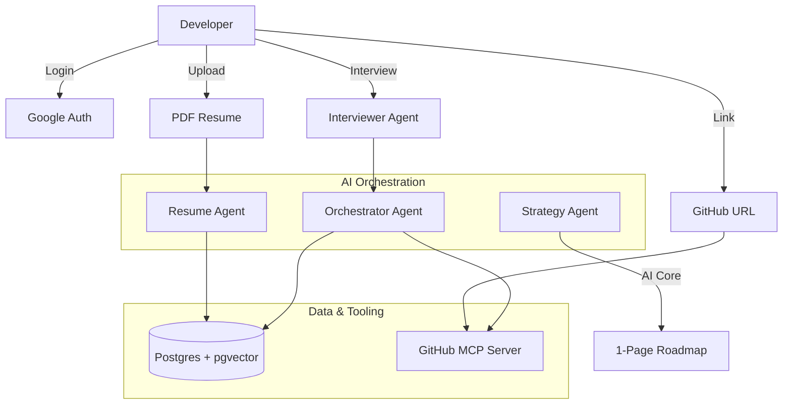

<div align="center">

# 🚀 Pocket OSS Agent

**Your AI-powered co-pilot for open-source contribution.**  
Drop your resume. Pick a repo. Get a personalized, one-page contribution roadmap in seconds.

[](LICENSE)
[](https://python.org)
[](https://github.com/langchain-ai/langgraph)
[](https://github.com/pgvector/pgvector)
[](https://github.com/github/github-mcp-server)

</div>

---

## ✨ What is this?

Getting started with open source is hard. You don't know which issue to pick, whether maintainers are active, or if your skills even match the codebase.

**Pocket OSS Agent** solves this with a multi-agent AI pipeline that:
1. Reads your resume to understand your skills
2. Interviews you to understand your *goals*
3. Investigates the target GitHub repo using the official GitHub MCP Server
4. Finds the single best issue for you — semantically, not just by label
5. Delivers a **one-page contribution roadmap** tailored to you

---

## 🎯 User Flow

```
Login → Upload Resume → Interview → Pick Repo → Agentic Analysis → 1-Page Roadmap
```

| Step | What happens |
|------|-------------|
| 1. **Authentication** | Secure login via Google OAuth 2.0 |
| 2. **Profile Ingestion** | AI parses your PDF resume into a structured Developer Context |
| 3. **Interactive Discovery** | Interviewer Agent clarifies your goals, time budget, and preferences |
| 4. **Project Selection** | You provide any public GitHub repository URL |
| 5. **Agentic Analysis** | Resume Agent + Repo Agent work in parallel |
| 6. **Strategy Generation** | Weaver Agent synthesizes everything into a single-screen roadmap |

---

## 🤖 Agent Architecture

The system uses **four specialized agents** orchestrated via [LangGraph](https://github.com/langchain-ai/langgraph):



| Agent | Role |
|-------|------|
| **Orchestrator** | Manages state and task sequencing across the pipeline |
| **Interviewer** | Asks 4–5 targeted questions to capture contribution intent |
| **Resume Parser** | Extracts languages, frameworks, seniority, and domain from PDF |
| **Strategy Generator** | Weaves all signals into the final one-page roadmap |

---

## 🌟 Core Features

### 🧠 Intelligent Skill Matching
Uses **pgvector** to run semantic similarity searches between your resume profile + interview answers and open GitHub issues — not just keyword matching.

### 🔍 GitHub MCP Server Integration
Agents interact with GitHub through the [official GitHub MCP Server](https://github.com/github/github-mcp-server), enabling token-efficient summarization of large repos (issue lists, file trees, PR history) before passing data to the AI.

### 💬 Vibe Check
Real-time sentiment analysis on maintainer responsiveness: commit recency, issue response time, PR merge rate, and contributor-welcome signals.

### 🚀 First Mile Setup
Auto-detects your repo's toolchain (Docker, Poetry, npm, Gradle, etc.) and generates a validated step-by-step local environment setup.

---

## 📄 The One-Page Roadmap

Every roadmap fits in a single screen and contains four sections:

```markdown
# OSS Contribution Roadmap: {repo}
> 🎯 Goal: portfolio · ⏱️ Availability: light (~5 hrs/week)

## 🗺️ Architecture Snapshot
- `src/` — Core library logic
- `tests/` — Unit and integration tests

## 🚀 First Mile Setup
1. git clone ... 
2. poetry install ✅
3. docker-compose up -d ✅

## 🎯 Your First Contribution
**Issue:** Add support for async Python client
**Why you:** 5 years Python + asyncio. Matches your portfolio goal.

## 💬 Vibe Check
🟢 Highly welcoming — last commit 2 days ago, issues answered in ~1 day.
```

---

## 🛠️ Technical Stack

| Layer | Technology |
|-------|-----------|
| **AI Model** | State-of-the-art high-reasoning model |
| **Orchestration** | Python · FastAPI · LangGraph |
| **Database** | PostgreSQL + `pgvector` extension |
| **GitHub Tooling** | Official GitHub MCP Server |
| **UI** | Streamlit or Next.js |

---

## 🤖 Agent Skills

This repo ships with 7 reusable [Antigravity](https://antigravity.dev) agent skills under `.agents/skills/`:

| Skill | Purpose |
|-------|---------|
| [`interviewer-agent`](.agents/skills/interviewer-agent/SKILL.md) | Dynamic pre-analysis discovery interview |
| [`resume-parser`](.agents/skills/resume-parser/SKILL.md) | Structured developer profile extraction from PDF |
| [`github-repo-investigator`](.agents/skills/github-repo-investigator/SKILL.md) | MCP-powered deep repo analysis |
| [`skill-matcher`](.agents/skills/skill-matcher/SKILL.md) | pgvector semantic issue matching with interview filters |
| [`env-setup-validator`](.agents/skills/env-setup-validator/SKILL.md) | Auto-detect toolchain + generate First Mile setup |
| [`repo-vibe-checker`](.agents/skills/repo-vibe-checker/SKILL.md) | Contributor-friendliness sentiment analysis |
| [`contribution-strategy-generator`](.agents/skills/contribution-strategy-generator/SKILL.md) | Weaves all outputs into the final 1-page roadmap |

---

## 🗺️ Roadmap

- [ ] Core agent pipeline (LangGraph)
- [ ] Resume parser + pgvector embeddings
- [ ] GitHub MCP Server integration
- [ ] Interviewer agent UI flow
- [ ] Skill matcher with interview context filters
- [ ] Streamlit MVP demo
- [ ] Next.js production UI
- [ ] Auth (Google OAuth 2.0)

---

## 🤝 Contributing

Contributions are welcome! Please open an issue first to discuss what you'd like to change.

---

## 📄 License

MIT © [rvishravars](https://github.com/rvishravars)
