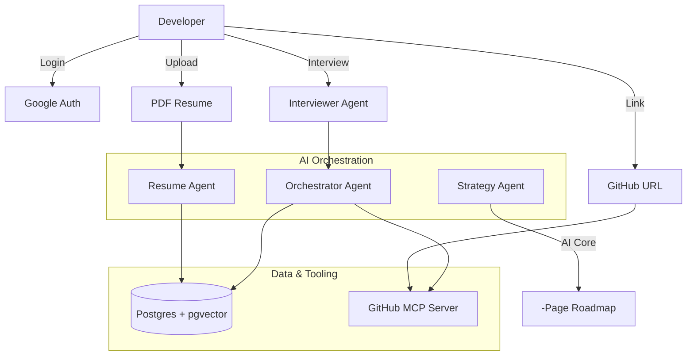

# 🚀 Pocket OSS Agent MVP: Feature & Design Specification

This specification outlines the technical blueprint for a mobile-ready, AI-driven platform designed to provide developers with a personalized, one-page open-source contribution strategy.

---

## 🎯 High-Level User Flow
1. **Authentication:** User logs in securely via **Google Authenticator**.
2. **Profile Ingestion:** User uploads their **Resume (PDF)**.
3. **Interactive Discovery:** The **Interviewer Agent** asks targeted questions to clarify goals and time availability.
4. **Project Selection:** User provides a public **GitHub Repository URL**.
5. **Agentic Analysis:** 
   - **Resume Agent:** Parses skills and experience level.
   - **Repo Agent:** Investigates the codebase using the **GitHub MCP Server**.
6. **Strategy Generation:** AI synthesizes data into a structured **One-Page Roadmap**.

---

## 🌟 Core Features

### 1. Identity & Skill Profiling
* **Google OAuth 2.0:** Secure login integration.
* **AI Resume Parser:** An agent that extracts a structured technical profile (languages, frameworks, and seniority) from the uploaded PDF to use as the "Developer Context."

### 2. Intelligent Data Hub (Postgres + pgvector)
* **Unified Database:** **PostgreSQL** serves as both the relational store (user data) and the Vector Database.
* **pgvector Integration:** Stores high-dimensional embeddings of repository documentation (`README.md`, `CONTRIBUTING.md`) for semantic retrieval.
* **Skill-Matching Engine:** Performs vector similarity searches to align the developer's resume profile and interview answers with the repository's technical needs.

### 3. Optimized GitHub Investigation (Official MCP Server)
* **GitHub MCP Server:** Acts as the primary interface for agents to interact with GitHub APIs.
* **Token Optimization:** Uses the MCP server to slice and summarize large repository data (like issue lists or file trees) before passing it to the AI, significantly reducing input token costs.
* **Real-time Triage:** Scans live issues for `good-first-issue` labels and recent PR activity to ensure the project is welcoming.

---

## 🏗️ Technical Design

### Multi-Agent Design
The system utilizes **four specialized agents** coordinated through a stateful workflow (e.g., LangGraph):

1.  **Orchestrator Agent:** Manages the sequence of tasks and maintains state between the resume scan and the repo investigation.
2.  **Interviewer Agent:** Conducts a dynamic set of questions before drafting to refine the recommendation based on user intent.
3.  **Resume Parser Agent:** Specialized in extracting and structuring developer capabilities from static files.
4.  **Strategy Generator Agent:** The final "Weaver" that takes the repo facts, developer skills, and interview insights to write the strategy.

### Component Diagram

---

## 📄 Output Specification: The One-Page Strategy
The final result is a Markdown document restricted to a single screen-view, containing:

*   **Architecture Snapshot:** A high-level map of where the core logic and tests reside.
*   **The "First Mile" Setup:** Validated local environment commands (Docker, build scripts, etc.).
*   **Personalized Target:** A specific GitHub issue chosen because it matches the developer's specific skills (e.g., Java/AWS).
*   **Vibe Check:** Real-time sentiment on how quickly maintainers respond to new contributors.

---

## 🛠️ Technical Stack
*   **LLM:** State-of-the-art AI model (High-reasoning model for codebase mapping).
*   **Database:** PostgreSQL with `pgvector` extension.
*   **Tooling:** Official GitHub MCP Server.
*   **Orchestration:** Python (FastAPI / LangGraph).
*   **UI:** Streamlit or Next.js for the demonstrator interface.